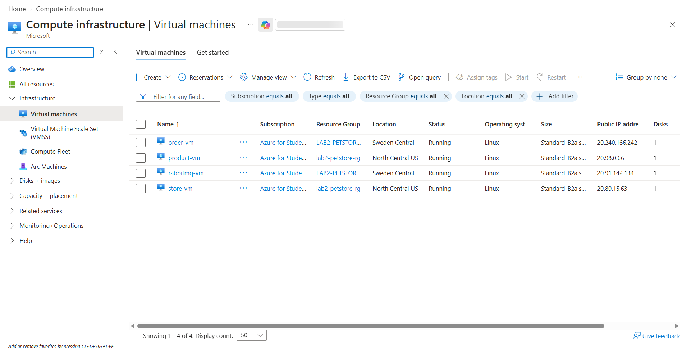
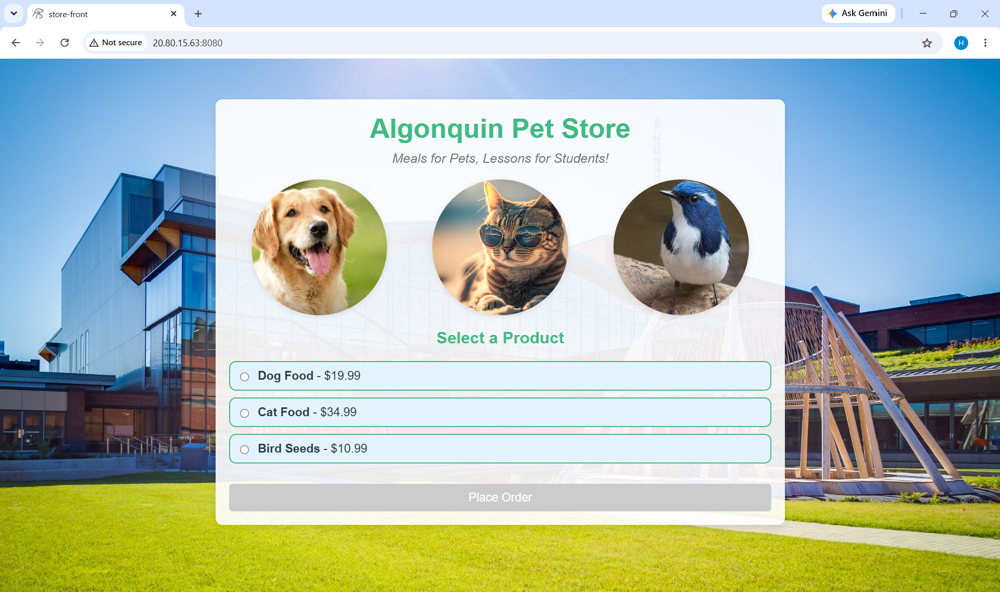
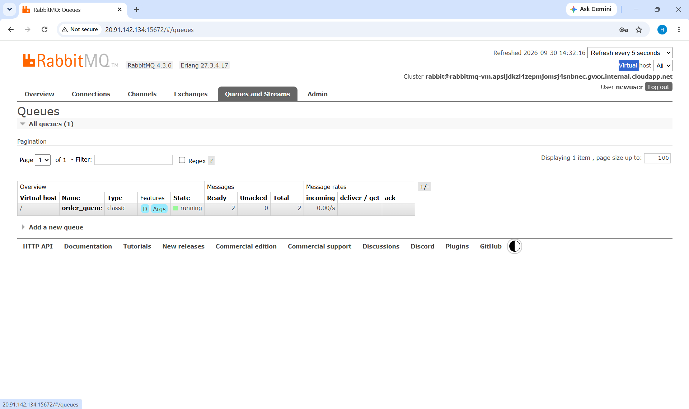

# CST8915 Lab 2: 12-Factor Refactor of the Algonquin Pet Store

**Student Name**: Hanan Ali
**Student ID**: 041153451
**Course**: CST8915 Full-stack Cloud-native Development
**Semester**: Fall 2026

---

## Demo Video

🎥 [Watch Demo Video](https://youtu.be/UOTBpES8uEY)

---

## Service Repositories

| Service | Repository |
|---|---|
| Order Service (Node.js) | https://github.com/HananAli89/order-service |
| Product Service (Rust) | https://github.com/HananAli89/product-service |
| Store Front (Vue.js) | https://github.com/HananAli89/store-front |

---

Each component runs on its own Azure VM (Ubuntu 24.04):

| VM | Runs | Port | Inbound source (NSG) |
|---|---|---|---|
| rabbitmq-vm | RabbitMQ (backing service) | 5672 (AMQP), 15672 (optional UI) | order-vm public IP / my laptop IP |
| order-vm | order-service | 3000 | my laptop IP |
| product-vm | product-service | 3030 | my laptop IP |
| store-vm | store-front | 8080 | my laptop IP |

SSH (22) on all four VMs is limited to my laptop's IP.

---

## Reflection Questions

### 1. What changes did you make to the order-service and product-service to comply with the Configuration and Backing Services factors?

In the order-service, I replaced the hard-coded `amqp://localhost` with `process.env.RABBITMQ_CONNECTION_STRING` and made the port come from `process.env.PORT`. In the product-service, I replaced the hard-coded port 3030 with `env::var("PORT")`. Both services now use `dotenv` to load these values from a `.env` file, and I added `.env` to `.gitignore` so the password is never pushed to GitHub. For Backing Services, RabbitMQ now runs on its own VM, and the order-service connects to it using only the connection string. If I wanted to switch to a different RabbitMQ server, I would just change the `.env` value, not the code.

### 2. Why is it important to use environment variables instead of hard-coding configurations?

Hard-coded values only work in one place. In Lab 1 everything used `localhost`, which broke as soon as each service moved to its own VM. With environment variables, the same code can run anywhere and only the config changes. It also keeps secrets like the RabbitMQ password out of the code. I saw this directly in the lab: when I forgot to save my `.env`, the order-service showed `injected env (0)` and used the defaults, and after saving it showed `injected env (2)`.

### 3. Why is it important to have separate repositories for each microservice?

Separate repositories keep each service independent. Each VM only cloned the code it needed, for example product-vm only had the Rust project. Each service has its own dependencies and commit history, so changing one service doesn't affect the others. This also makes it easier to update or scale one service on its own, or have different people work on different services.

---

## Challenges and Learnings
- **vCPU quota:** Azure for Students only allowed 6 vCPUs per region and the 1-vCPU sizes were not available, so I split the VMs across two regions: RabbitMQ and order-service in Sweden Central, product-service and store-front in North Central US. This still works because the services talk to each other over public IPs.
- **SSH key permissions on Windows:** SSH refused the new `.pem` key because another local user had inherited access to it. I fixed it with `icacls` so only my account can read the file, same way I did for Lab1.
- **Unsaved `.env`:** The order-service first started with `injected env (0)` because the `.env` file was not saved yet. Saving it and restarting showed `injected env (2)`.

---

## Screenshots

---